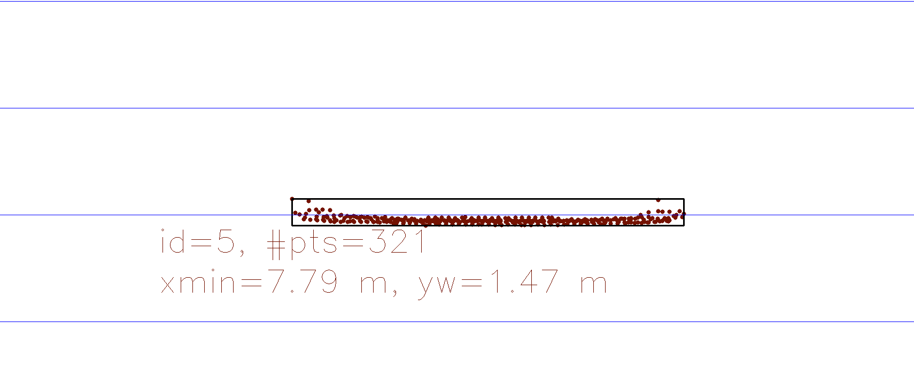
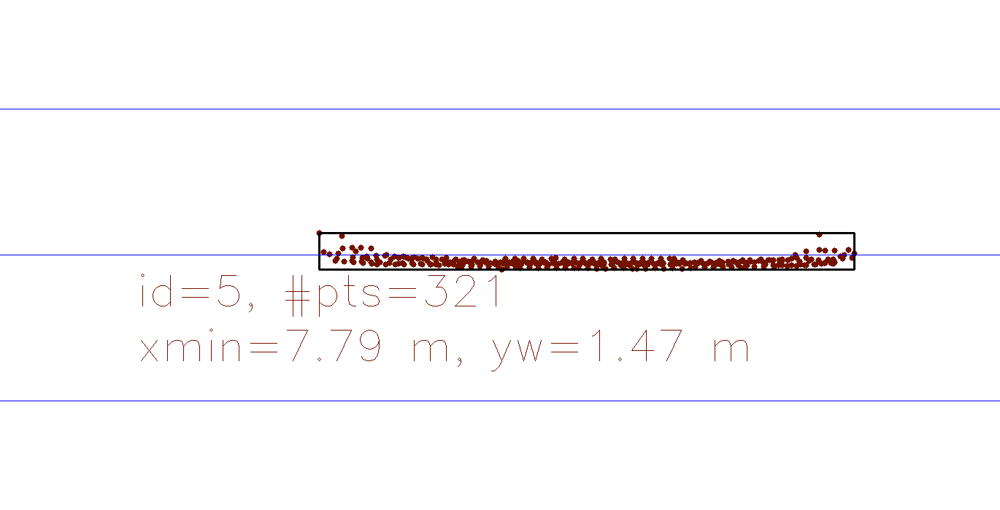
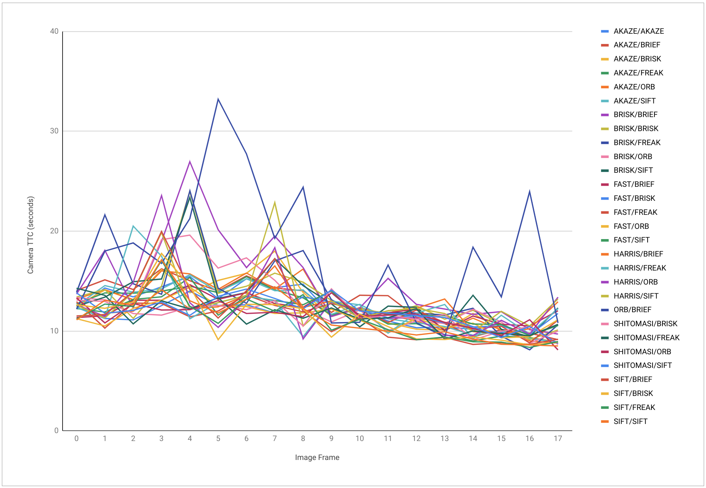

# SFND 3D Object Tracking

Welcome to the final project of the camera course. By completing all the lessons, you now have a solid understanding of keypoint detectors, descriptors, and methods to match them between successive images. Also, you know how to detect objects in an image using the YOLO deep-learning framework. And finally, you know how to associate regions in a camera image with Lidar points in 3D space. Let's take a look at our program schematic to see what we already have accomplished and what's still missing.


In this final project, you will implement the missing parts in the schematic. To do this, you will complete four major tasks:

1. First, you will develop a way to match 3D objects over time by using keypoint correspondences.
2. Second, you will compute the TTC based on Lidar measurements.
3. You will then proceed to do the same using the camera, which requires to first associate keypoint matches to regions of interest and then to compute the TTC based on those matches.
4. And lastly, you will conduct various tests with the framework. Your goal is to identify the most suitable detector/descriptor combination for TTC estimation and also to search for problems that can lead to faulty measurements by the camera or Lidar sensor. In the last course of this Nanodegree, you will learn about the Kalman filter, which is a great way to combine the two independent TTC measurements into an improved version which is much more reliable than a single sensor alone can be. But before we think about such things, let us focus on your final project in the camera course.

## Dependencies for Running Locally

- cmake >= 2.8
  - All OSes: [click here for installation instructions](https://cmake.org/install/)
- make >= 4.1 (Linux, Mac), 3.81 (Windows)
  - Linux: make is installed by default on most Linux distros
  - Mac: [install Xcode command line tools to get make](https://developer.apple.com/xcode/features/)
  - Windows: [Click here for installation instructions](http://gnuwin32.sourceforge.net/packages/make.htm)
- Git LFS
  - Weight files are handled using [LFS](https://git-lfs.github.com/)
- OpenCV >= 4.1
  - This must be compiled from source using the `-D OPENCV_ENABLE_NONFREE=ON` cmake flag for testing the SIFT and SURF detectors.
  - The OpenCV 4.1.0 source code can be found [here](https://github.com/opencv/opencv/tree/4.1.0)
- gcc/g++ >= 5.4
  - Linux: gcc / g++ is installed by default on most Linux distros
  - Mac: same deal as make - [install Xcode command line tools](https://developer.apple.com/xcode/features/)
  - Windows: recommend using [MinGW](http://www.mingw.org/)

## Basic Build Instructions

1. Clone this repo.
2. Make a build directory in the top level project directory: `mkdir build && cd build`
3. Compile: `cmake .. && make`
4. Run it: `./3D_object_tracking`.

## FP.1 Associate Keypoint Correspondences with Bounding Boxes

This is implemented in the function `matchBoundingBoxes`. The keypoints are compared against each bounding box from the previous frame to determine which keypoints fall within each bounding box. The keypoints within each bounding box are then tested against the current frame bounding boxes. The previous and current frame bounding box combination that share the highest common number of keypoints are then recorded.

## FP.2 Compute Lidar-based TTC

This is implemented in the function `computeTTCLidar`. The mean of all the Lidar point x distances is calculated and points that do not fall within a standard deviation of the mean are considered outliers. The closest valid point is then used to calculate TTC.

## FP.3 Associate Keypoint Correspondences with Bounding Boxes

This is implemented in the function `clusterKptMatchesWithROI`. The mean of the euclidean distances is calculated and outliers that are not within a standard deviation of the mean are removed.

## FP.4 Compute Camera-based TTC

This is implemented in the function `computeTTCCamera`. Outliers are eliminated by using the median distance ratio between keypoints.

## FP.5 Performance Evaluation 1

There are several cases where the LIDAR TTC can report an incorrect value. As seen in the table below, there are occasions where the time to collision value will significantly increase from one frame to the next, despite the relative position of the vehicles remaining the same.

| Frame | TTC Lidar (seconds) | Lidar Points Xmin |
| ----- | ------------------- | ----------------- |
| 6     | 13.12               | 7.79              |
| 7     | 16.90               | 7.79              |
| 34    | 8.89                | 6.90              |
| 35    | 11.16               | 6.90              |


_LIDAR Points Frame 6_

_LIDAR Points Frame 7_

This can be explained by the formula used to calculate the TTC:

```
  TTC = (minPrevX * deltaT) / (minPrevX - minCurrX);
```

As the difference between `minPrevX` and `minCurrX` decreases, the TTC will increase. To work around this limitation, more logic could be added to calculate the TTC over data from several frames.

## FP.6 Performance Evaluation 2

HARRIS / BRISK crashed

The graph below shows the time to collision for each image frame.
These tests were repeated for each detector / descriptor combination. Note that all ORB detectors have been excluded as they produced very large and erroneous values making the graph hard to properly scale.



To get additional insight into the performance of the different detector / descriptor combinations, the difference between the camera TTC and LIDAR TTC for each image frame and combination was calculated. The results were sorted by in ascending order, where a smaller total difference indicates better performance. The top 5 results are shown in the table below:

| Frame       | AKAZE/FREAK | SIFT/SIFT | AKAZE/AKAZE | AKAZE/SIFT | SHITOMASI/SIFT |
| ----------- | ----------- | --------- | ----------- | ---------- | -------------- |
| 0           | 0.1183      | 1.4873    | 0.3909      | 0.0787     | 1.2086         |
| 1           | 0.6917      | 0.0517    | 1.1786      | 1.4177     | 1.354          |
| 2           | 3.1178      | 4.2958    | 3.4843      | 3.0126     | 4.8392         |
| 3           | 0.1133      | 3.034     | 0.3157      | 0.1144     | 1.1929         |
| 4           | 1.4222      | 0.0379    | 2.3792      | 2.5595     | 1.5061         |
| 5           | 0.6597      | 1.3795    | 0.0594      | 0.757      | 0.2846         |
| 6           | 1.6462      | 0.5862    | 1.4482      | 1.4276     | 0.4109         |
| 7           | 0.0736      | 0.2318    | 0.1527      | 0.1671     | 0.9399         |
| 8           | 1.0404      | 0.0333    | 2.4112      | 1.8315     | 0.0513         |
| 9           | 0.5566      | 1.5814    | 0.593       | 0.5037     | 1.9229         |
| 10          | 0.3601      | 1.6001    | 0.2735      | 0.7852     | 0.1119         |
| 11          | 0.5255      | 0.17753   | 0.8308      | 1.0472     | 1.6236         |
| 12          | 1.3098      | 0.17616   | 0.9038      | 1.4018     | 2.1272         |
| 13          | 0.06676     | 0.35273   | 0.84764     | 0.88934    | 1.78554        |
| 14          | 0.54386     | 0.71948   | 1.69802     | 1.10641    | 1.96822        |
| 15          | 0.6034      | 0.21206   | 0.97675     | 1.10864    | 0.4547         |
| 16          | 1.83239     | .55433    | 1.93683     | 1.88727    | 0.7068         |
| 17          | 0.25164     | 0.10329   | 0.2925      | 0.25484    | 0.14306        |
| Grand Total | 14.93325    | 18.61458  | 20.17304    | 20.3505    | 22.63142       |

In cases where the performance was poor, it can be explained by:

- Improperly matched keypoints
- Keypoints matched outside the vehicle (road markings, shadows, etc)
- High variance from small number of keypoints detected
